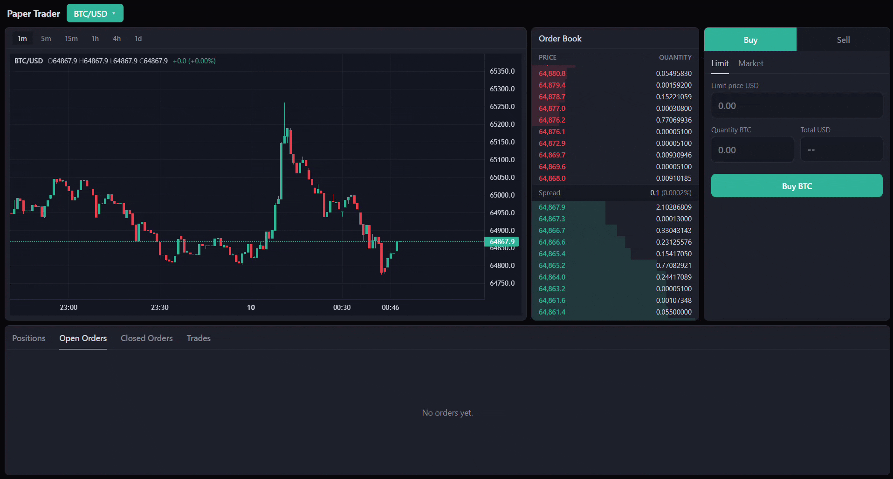

# Real-Time Paper Trading Platform

A real-time trading platform on live Kraken market data. A C++ engine
maintains a live order book and matches simulated orders against it. A Go
backend independently streams Kraken's OHLC candles, bridges both feeds to
clients over WebSocket, and persists orders/fills/positions. A React
frontend renders a live depth ladder, a candlestick chart, and an
order-entry/position-tracking terminal.



## Architecture

Three independent processes. The engine and backend talk over two IPC
boundaries; the backend and frontend talk over plain WebSockets:

```
 Kraken WS/REST                                  Kraken WS/REST
 (book channel)                                 (ohlc channel + history)
       │                                               │
       ▼                                               ▼
┌─────────────┐                                 ┌─────────────┐    WebSocket    ┌──────────┐
│  C++ engine │──── shared memory ─────────────▶│  Go backend │◀───────────────▶│ frontend │
│ (order book,│       (snapshots + deltas)      │ (book+candle│                 │ (React/  │
│  matching)  │◀──────── gRPC control plane ────│  fan-out,   │                 │  Vite)   │
└─────────────┘   SubscribeBook / PlaceOrder /  │  orders/DB) │                 └──────────┘
                           WatchFills           └─────────────┘
```

The engine and backend are separate OS processes so the latency-sensitive
engine can be restarted, profiled, or debugged independently of the
web-facing backend. The candle pipeline never touches the engine — it's a
second, independent connection the backend makes to Kraken on its own.

Per-component design details: [engine](engine/README.md),
[backend](backend/README.md).

## Benchmarks and replay tooling

`docs/benchmarks/` has real measured latency numbers (p50/p90/p99/max) for
the engine's tick-to-book-update and ring-buffer push/pop paths, and the
methodology used to produce them — see
[`docs/benchmarks/README.md`](docs/benchmarks/README.md).

The same replay tooling doubles as a recording/regression-testing utility,
scoped to the book channel only (it has no relationship to the candle
pipeline, which lives entirely in the Go backend):
- `kraken_recorder --symbol <symbol> --out <path> [--duration <seconds>]` —
  records a live Kraken book session to a `.ptrec` file (default 300s,
  Ctrl-C to stop early; `scripts/record_kraken_feed.sh` wraps this).
- `kraken_replayer` — replays a recorded session at real/burst speed as a
  load generator, or in `verify` mode as a golden-checksum regression test
  (wired into `engine_tests` as `replay_golden`).

## Prerequisites

| Component | Needed for native builds |
|---|---|
| Engine | CMake 3.20+, Ninja, a C++20 compiler, [vcpkg](https://github.com/microsoft/vcpkg) |
| Backend | Go 1.26+, `protoc` (only to regenerate `genproto/`) |
| Frontend | Node 22+ |
| Docker | Docker Desktop / Docker Engine + Compose v2 |

## Docker (recommended)

```
docker compose up -d
```

This builds and starts all three services:

| Service | Container port | Published on host |
|---|---|---|
| `engine` | 50051 (gRPC) | `localhost:50051` (optional, debugging only) |
| `backend` | 8000 (HTTP/WS) | `localhost:8000` |
| `frontend` | 80 (nginx) | `localhost:5173` |

`engine` and `backend` share a named Docker volume mounted at `/dev/shm` in
both containers — this is what makes the shared-memory segment visible
across the container boundary (see [Shared memory across
containers](#shared-memory-across-containers) below).

The first `docker compose build engine` compiles Boost, gRPC, OpenSSL,
Protobuf, and simdjson from source via vcpkg for `x64-linux` — this can
take 20-60+ minutes uncached. Subsequent builds reuse that layer as long as
`engine/vcpkg.json` doesn't change, and only recompile the engine's own
source (a few seconds).

### Shared memory across containers

`docker-compose.yml` mounts the same named volume (`shm-data`) at
`/dev/shm` in both the `engine` and `backend` services, so the engine's
shared-memory segment is visible to the backend.

## Local development

### Engine

Native builds need a local vcpkg installation. Configure with the
`release` (or `debug`) preset, pointing `CMAKE_TOOLCHAIN_FILE` at your
vcpkg's `vcpkg.cmake`:
```
cmake --preset release -S engine -DCMAKE_TOOLCHAIN_FILE=<path-to-your-vcpkg>/scripts/buildsystems/vcpkg.cmake
cmake --build engine/out/build/release --target engine
engine/out/build/release/engine.exe
```

The resulting binary reads `ENGINE_GRPC_HOST`/`ENGINE_GRPC_PORT` (default
`127.0.0.1:50051`) and writes its shared-memory segment to
`<repo>/.shm/paper_trader_book_v1` by default.

### Backend

```
cd backend
go run ./cmd/server
```

Regenerate gRPC bindings (only needed after editing
`engine/proto/paper_trader.proto`; `genproto/` is gitignored):
```
bash scripts/gen_proto.sh   # needs protoc on PATH
```

Defaults: listens on `0.0.0.0:8000`, looks for the engine at
`127.0.0.1:50051`, opens its SQLite DB at `<repo>/backend/paper_trader.db`,
and attaches to the engine's shared-memory segment at
`<repo>/.shm/paper_trader_book_v1`. The candle pipeline needs no engine and
no additional configuration — it connects to Kraken directly.

### Frontend

```
cd frontend
npm install
npm run dev
```

### All three together

```
bash scripts/run_dev.sh
```

Starts the engine (`engine/out/build/debug-local/engine.exe`), the backend,
and the frontend dev server as background jobs, and kills all three
together on exit. `debug-local` isn't one of the tracked presets in
`CMakePresets.json` (`debug`/`release`/`linux-release`) — it's expected to
be a local preset you define yourself; point the script at a different
binary path if you're using one of the tracked presets instead.

## Project structure

```
engine/             C++ matching engine (see engine/README.md)
  src/, include/      order book, matching engine, Kraken book-WS client, IPC, gRPC control server
  proto/              paper_trader.proto -- shared gRPC contract with the backend
  tests/              Catch2 test suite (engine_tests)
  tools/replay/       kraken_recorder, kraken_replayer, test_engine_harness
  CMakeLists.txt, CMakePresets.json, vcpkg.json, Dockerfile

backend/             Go backend (see backend/README.md)
  cmd/server/          entrypoint (main.go)
  internal/book/       shared-memory reader, WS fan-out, backpressure/resync (talks to the engine)
  internal/candle/     independent Kraken OHLC WS client + REST history, WS fan-out (never talks to the engine)
  internal/trading/    order placement, fill streaming, engine-restart reconciliation
  internal/control/    gRPC client to the engine
  internal/persistence/  SQLite order/fill storage, FIFO position/P&L accounting
  internal/observability/  book counters (resyncs, overflows, drops)
  internal/integration/    cross-package/cross-process tests
  internal/schemas/    WS message types shared by book/candle/trading
  internal/symbols/    /api/symbols handler (Kraken AssetPairs -> tradable symbol list)
  genproto/            generated gRPC bindings (gitignored, see below)
  scripts/             gen_proto.sh -- regenerates genproto/ from engine/proto/
  Dockerfile

frontend/            React + Vite + TypeScript UI
  src/components/      depth ladder, candle chart, order entry, open/closed orders, fills, P&L, symbol search
  src/hooks/           one WebSocket hook per channel (book/candle/control)
  src/state/           BookStore (client-side snapshot+delta mirror)
  Dockerfile, nginx.conf

docs/benchmarks/     real measured p50/p90/p99 latency numbers for the engine's hot paths
scripts/             run_dev.sh (local dev), record_kraken_feed.sh
docker-compose.yml, .dockerignore   root-level, wire all three services together
```

## Testing

**Engine** (Catch2, via CTest):
```
cmake --build engine/out/build/<preset> --target engine_tests kraken_replayer
ctest --test-dir engine/out/build/<preset> --output-on-failure
```
Covers order-book invariants, matching-engine correctness (property-based),
the ring buffer under real cross-process stress, seqlock snapshot reads
under concurrent writers, and checksum-mismatch resync recovery. Includes a
golden-checksum regression test (`replay_golden`) against a committed,
recorded Kraken session — it shells out to the `kraken_replayer` binary, so
that target must be built too, not just `engine_tests`. The ring-buffer
stress test uses Windows-only
process-spawning APIs, so `engine_tests` only builds/runs on Windows today
— the Linux Docker build only builds the `engine` target, not the tests.

**Backend** (`go test`):
```
cd backend
go test ./...
```
Covers subscription refcounting, backpressure/resync behavior, candle
reconnect logic, and two integration-level tests: a path-independence test
(killing the candle feed doesn't affect the book feed, and vice versa —
the direct proof that the two pipelines described in
[Architecture](#architecture) are actually independent, not just drawn that
way) and an opt-in cross-process test that spawns a real engine binary and
verifies the real C++ writer and Go reader agree on the shared-memory
layout end to end. The cross-process test is skipped unless
`PAPER_TRADER_TEST_ENGINE_BIN` is set — point it at either a real
`engine.exe`, or (recommended, since it's deterministic and needs no
network) the `test_engine_harness` target built alongside `engine_tests`:
Go test binaries run with their working directory set to the package's own
source directory (`backend/internal/integration/`), not the repo root or
wherever `go test` was invoked from -- so `PAPER_TRADER_TEST_ENGINE_BIN`
needs an absolute path. From `backend/`:
```
cmake --build engine/out/build/<preset> --target test_engine_harness

# bash
PAPER_TRADER_TEST_ENGINE_BIN="$(pwd)/../engine/out/build/<preset>/tools/replay/test_engine_harness" \
  go test -run CrossProcess -v ./internal/integration/...

# PowerShell
$env:PAPER_TRADER_TEST_ENGINE_BIN = (Resolve-Path "..\engine\out\build\<preset>\tools\replay\test_engine_harness.exe").Path
go test -run CrossProcess -v ./internal/integration/...
```

## API reference

All prices/sizes on the backend's public API are integer **ticks** (fixed
point, scale `1e10`), not floats — this avoids floating-point drift in
anything price-related. `PriceTicks`/`SizeTicks` throughout are ticks, not
decimal strings, with one exception: the WS `place_order` message takes
`price`/`size` as decimal strings (`"64250.5"`), converted to ticks
backend-side.

### HTTP (served by the Go backend, default `http://localhost:8000`)

| Method & path | Description |
|---|---|
| `GET /health` | Liveness check. Returns `{"status":"ok"}` unconditionally. |
| `GET /api/symbols` | Tradable symbols, fetched from Kraken's `AssetPairs` REST endpoint and cached in-process. Returns `[{"symbol":"BTC/USD","priceDecimals":1,"quantityDecimals":8}, ...]`, USD pairs only, `XBT` normalized to `BTC`. |
| `GET /api/candles/history?symbol=&interval=&count=` | Historical OHLC bars from Kraken's REST API — independent of the live `ohlc` WS channel. `interval` in minutes (default `1`), `count` (default `720`, capped at `720`). Returns `[{"time":1700000000,"open":...,"high":...,"low":...,"close":...}, ...]`. |
| `GET /debug/book_counters` | `internal/observability`'s book counters as JSON: `{"resyncs":N,"clientOverflows":N,"droppedBySymbol":{"BTC/USD":N}}`. |

### WebSocket: `/ws/book`

Client → server:
```jsonc
{"type": "subscribe_book", "symbol": "BTC/USD"}
{"type": "unsubscribe_book", "symbol": "BTC/USD"}
```
Server → client:
```jsonc
{"type": "book_snapshot", "symbol": "BTC/USD", "seq": 233, "bids": [{"priceTicks":..., "sizeTicks":...}, ...], "asks": [...]}
{"type": "book_delta", "symbol": "BTC/USD", "seq": 234, "side": "bid", "priceTicks": ..., "sizeTicks": ...}
```
A snapshot is always sent immediately after subscribing (and again after any resync); `sizeTicks: 0` on a delta means "remove this price level," matching Kraken's own book-update convention.

### WebSocket: `/ws/candles`

Client → server:
```jsonc
{"type": "subscribe_candle", "symbol": "BTC/USD", "interval": 1}
{"type": "unsubscribe_candle", "symbol": "BTC/USD", "interval": 1}
```
(`interval` in minutes, defaults to `1` if omitted.)

Server → client:
```jsonc
{"type": "candle", "symbol": "BTC/USD", "interval": "1m", "time": 1700000000, "open": 64250.5, "high": ..., "low": ..., "close": ..., "volume": ..., "closed": false}
```
`closed: true` is sent once, for the *previous* bar, at the moment a new interval opens — everything else is `closed: false` updates to the still-forming current bar.

### WebSocket: `/ws/control`

Client → server:
```jsonc
{"type": "place_order", "symbol": "BTC/USD", "side": "buy", "orderType": "limit", "price": "64250.5", "size": "0.01", "clientRequestId": "abc123"}
{"type": "cancel_order", "orderId": 42, "clientRequestId": "abc124"}
```
`side` is `"buy"`/`"sell"`, `orderType` is `"market"`/`"limit"` (`price` is ignored/omitted for market orders). `clientRequestId` is caller-supplied and echoed back so a client can match acks to the request that triggered them.

Server → client:
```jsonc
{"type": "state_snapshot", "orders": [...], "positions": [...], "fills": [...]}   // sent once, right after connecting
{"type": "order_ack", "clientRequestId": "abc123", "orderId": 42, "status": "accepted", "reason": ""}
{"type": "order_update", "order": {"orderId": 42, "engineOrderId": 7, "symbol": "BTC/USD", "side": "buy", "orderType": "limit", "priceTicks": ..., "sizeTicks": ..., "status": "open", ...}}
{"type": "fill_event", "orderId": 42, "priceTicks": ..., "sizeTicks": ..., "ts": 1700000000000}
{"type": "positions_update", "positions": [{"symbol": "BTC/USD", "netSizeTicks": ..., "avgCostTicks": ..., "realizedPnlTicks": ...}]}
```
Every connected client sees every broadcast (`order_update`/`fill_event`/`positions_update`) — there's a single shared simulated account, not one per WebSocket connection. Order `status` progresses through `pending` → `open`/`unfilled` → `partially_filled` → `filled`, or terminates via `rejected` or `canceled` (`cancelReason` is `"user"` or `"engine_restart"`).

### gRPC control plane (engine ↔ backend, not exposed to the frontend)

Defined in `engine/proto/paper_trader.proto`, default `127.0.0.1:50051`:

| RPC | Request → Reply |
|---|---|
| `SubscribeBook` / `UnsubscribeBook` | `{symbol}` → `{ok, reason}` |
| `PlaceOrder` | `{symbol, side, type, price_ticks, size_ticks, client_request_id}` → `{accepted, engine_order_id, reject_reason, filled_size_ticks}` (`filled_size_ticks` is the synchronous match amount for a market order) |
| `CancelOrder` | `{engine_order_id}` → `{accepted, engine_order_id, reject_reason}` |
| `WatchFills` | `{}` → server-streamed `{engine_order_id, price_ticks, size_ticks, ts}` |
| `GetEngineInfo` | `{}` → `{instance_id}` (random per engine-process startup; see [Architecture](#architecture)) |

## Environment variables

| Variable | Read by | Default | Purpose |
|---|---|---|---|
| `ENGINE_GRPC_HOST` | engine | `127.0.0.1` | address the engine's gRPC server binds to |
| `ENGINE_GRPC_HOST` | backend | `127.0.0.1` | address the backend dials to reach the engine (same name, opposite ends of the connection — set independently on each side) |
| `ENGINE_GRPC_PORT` | engine, backend | `50051` | gRPC port, read the same way by both sides |
| `HOST` / `PORT` | backend | `0.0.0.0` / `8000` | backend HTTP/WS listen address |
| `DB_PATH` | backend | `<repo>/backend/paper_trader.db` | SQLite database path |
| `SHM_BASE_DIR` | backend | (unset → repo-relative `.shm/`) | base directory for the shared-memory segment file |
| `PAPER_TRADER_TEST_ENGINE_BIN` | backend tests | (unset → test skips) | path to a built engine/harness binary, for the cross-process test |

The frontend has no runtime configuration at all — its WebSocket/API URLs
are hardcoded to `localhost:8000` in `frontend/src/`, not read from any env
var or build-time variable. The candle pipeline (`internal/candle`) has no
env vars of its own either — it always connects to Kraken's real endpoints
(`internal/config`'s `KrakenOhlcWSURL`/`KrakenRestOhlcURL` constants).
